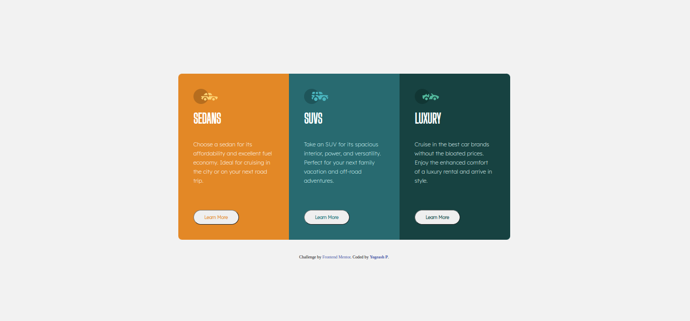

# Frontend Mentor - 3-column preview card component solution

## Table of contents

- [Overview](#overview)
  - [The challenge](#the-challenge)
  - [Screenshot](#screenshot)
  - [Links](#links)
- [My process](#my-process)
  - [Built with](#built-with)
  - [What I learned](#what-i-learned)
  - [Useful resources](#useful-resources)
- [Author](#author)

## Overview

Hi , I am Yogeash , I am newbie learning web development by building projects . FYI : I am not a computer science student ... 
I have spent around 4 hours in building this project .
This project helped me to figure out how basic website can be built using only css and html .

### The challenge

Users should be able to:

- View the optimal layout depending on their device's screen size
- See hover states for interactive elements

### Screenshot

**Desktop Type**

**Mobile Type**

### Links

- Solution URL: [https://www.frontendmentor.io/solutions/preview-card-dmtzhOua6r](https://your-solution-url.com)
- Live Site URL: [https://preview-card.pages.dev/](https://github.com/yogeash002/Preview_card.git)

## My process
<ul>
<li>At the begining , i started with seperating contents using divs and added classes in order to customize it .</li>
<li>Used various HTML tags for differnt purposes . </li>
<li>Linked google fonts in order to get correct font from the API </li>
- Used css for styling puporse.
- For further information about styling please visit <a href="style-guide.md">
</ul>

### Built with

- Semantic HTML5 markup
- CSS custom properties
- Flexbox
- CSS Grid
- Mobile-first workflow

### What I learned

-Some new HTML tags
-Functionality of HTML tags
-CSS grid
-CSS Properties

### Useful resources

- [W3School](https://www.w3schools.com/css/default.asp) - This helped me for CSS Refernce Purpose.
- [Google Fonts](https://www.example.com) - Helped me to get different fonts

## Author

- LinkedIn- [Yogeash P](hwww.linkedin.com/in/yogeashp)
- Twitter - [@PYogeash](https://twitter.com/PYogeash)

Thank You for Visiting !!

This is a solution to the [3-column preview card component challenge on Frontend Mentor](https://www.frontendmentor.io/challenges/3column-preview-card-component-pH92eAR2-). Frontend Mentor challenges help you improve your coding skills by building realistic projects. 